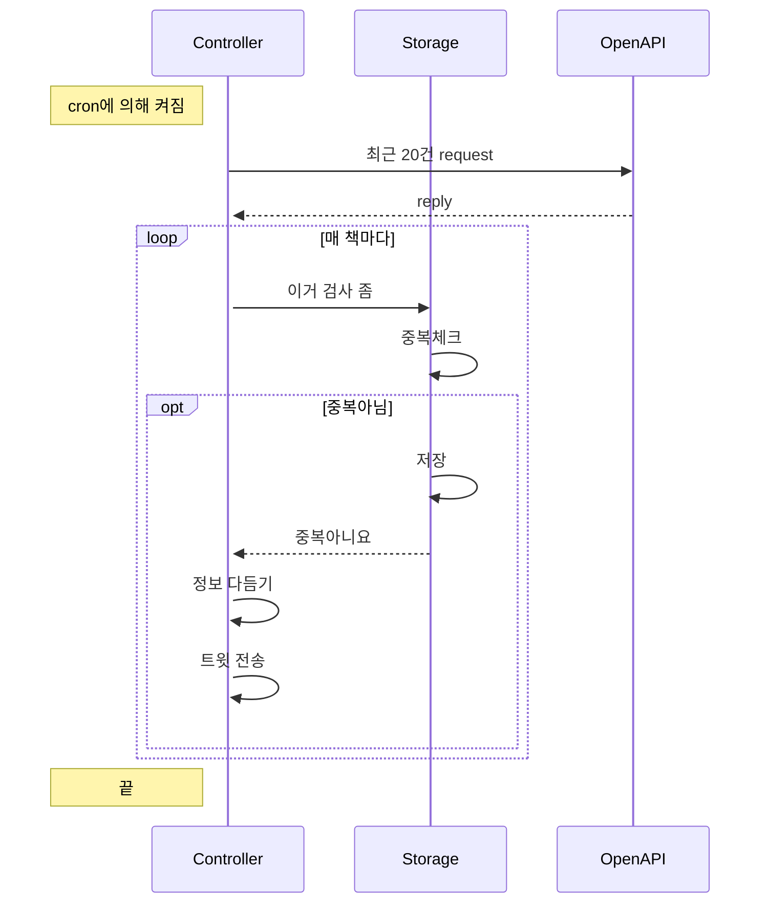

```mermaid
sequenceDiagram
    participant Controller
    participant Storage
    participant OpenAPI
    
    note left of Controller: cron에 의해 켜짐
    Controller->>OpenAPI: 최근 20건 request
    activate Controller
    OpenAPI-->>Controller: reply
    loop 매 책마다 
        Controller->>Storage: 이거 검사 좀
        Storage->>Storage: 중복체크
        opt 중복아님
            Storage->>Storage: 저장
            Storage-->>Controller: 중복아니요
            Controller->>Controller: 정보 다듬기 
            Controller->>Controller: 트윗 전송
        end 
    end
    note left of Controller: 끝 
```